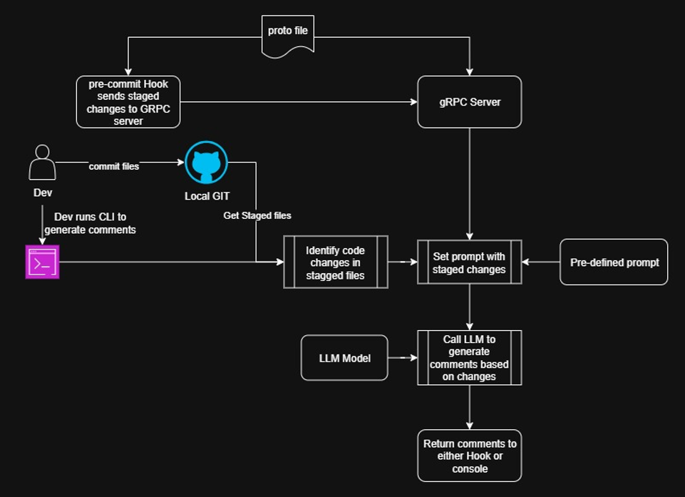

## git-commit-ai



### Overview
**git-commit-ai** generates high‑quality Git commit messages from your staged changes using an LLM. You can use it:
- **CLI**: run `cli.py` in any repo to print a suggested message
- **Git hook**: plug into `prepare-commit-msg` to auto‑populate messages
- **gRPC**: run a local server and call it from the hook or the provided client

### Features
- **Multiple LLM providers**: Gemini, OpenAI, Anthropic (select via config)
- **Simple config** via `config.yml` and `.env`
- **Two integration modes**: direct CLI or gRPC server/client
- **Windows-friendly** (use Git Bash for the hook script)

---

## Installation
### Requirements
- Python >= 3.13
- Git installed and available on PATH
- Install [grpcurl](https://github.com/fullstorydev/grpcurl)

### Install dependencies
From the project root:

```bash
pip install -e .
# or, if you prefer to install deps directly from pyproject
pip install -r <(python - <<PY
import tomllib, sys
with open('pyproject.toml','rb') as f:
    print('\n'.join(tomllib.load(f)['project']['dependencies']))
PY
)
```

Note: The project includes `pyproject.toml` (and `uv.lock` if you use `uv`). Any modern Python package manager (pip/uv/poetry/pdm) will work.

---

## Configuration
### 1) Environment variables
Create a `.env` file in the project root:

```env
LLM_API_KEY=your_provider_api_key
```

### 2) `config.yml`
Edit `config.yml` to select the model provider, model name, your local repo path, and gRPC port:

```yaml
model_config:
  - model_provider: "gemini"   # one of: gemini, openai, anthropic
  - model_name: "gemini-2.0-flash"
git_config:
  - local_git_path: "C:\\path\\to\\your\\repo"  # used by CLI mode
grpc_config:
  - grpc_server_port: 50051
```

Notes:
- `LLM_API_KEY` must match the selected provider (e.g., Gemini/OpenAI/Anthropic key).
- In CLI mode, the repo at `local_git_path` is read to compute staged diffs.
- The gRPC client is configured to call `localhost:50051` by default; keep this in sync with `grpc_server_port`.

---

## Usage
### CLI
Runs directly against the repo specified in `config.yml` (`git_config.local_git_path`). Prints a suggested commit message to stdout.

```bash
python cli.py
```

Under the hood:
- Staged changes are collected from `git_stage.get_staged_changes()`
- A prompt is built in `prompt.get_prompt()`
- The provider client is chosen in `model_provider.get_model_instance()`

### gRPC Server
Start the server (default port from `config.yml`):

```bash
python grpc_server/server.py
```

This starts `GITCommitMessageServicer` which exposes `GetCommitMessage`. It accepts a diff string and returns the generated commit message.

### gRPC Client (manual test)
With the server running, you can call it using the provided client:

```bash
python grpc_client/client.py
```

The client sends your staged diff (`git diff --cached`) to the server and prints the returned message.

---

## Git Hook Integration (prepare-commit-msg)
You can wire the hook to call the gRPC server and auto‑populate your commit message. `prepare-commit-msg` utilizes `grpcurl` to call server to get commit message. If you want to use python script `grpc_client\client.py` update `prepare-commit-msg` script. 

1) Ensure the gRPC server is running:
```bash
python grpc_server/server.py
```

2) Copy the provided hook script into your repo’s `.git/hooks` directory as `prepare-commit-msg`:
```bash
cp hook/prepare-commit-msg /path/to/your/repo/.git/hooks/prepare-commit-msg
chmod +x /path/to/your/repo/.git/hooks/prepare-commit-msg
```

3) Commit as usual. The hook will call the gRPC client and replace the commit message with the generated one.

Notes:
- The sample hook is a Bash script. On Windows, use Git Bash.
- Make sure the client path invoked by the hook matches your setup. The reference implementation here expects the Python client to be reachable and will print the generated message to stdout.

---

## How it works (high level)
- `cli.py`: Reads staged changes from `git_stage.get_staged_changes()` and prints the generated message
- `llm_client.py`: Builds the prompt and calls the configured provider client
- `model_provider.py`: Provider abstraction for Gemini, OpenAI, Anthropic
- `grpc_server/server.py`: Exposes `GetCommitMessage` via gRPC
- `grpc_client/client.py`: Sends `git diff --cached` to the server and prints the response
- `prompt.py`: Prompt template for summarizing diffs into commit messages
- `config.py` / `config.yml`: Loads and validates runtime configuration

---

## Troubleshooting
- No output or invalid API key: verify `.env` has `LLM_API_KEY` and matches the provider
- Empty suggestions: ensure you have staged changes (`git add ...`), and the correct repo path in `config.yml`
- gRPC errors: confirm the server is running on the configured port and the client points to the same port
- Hook not firing: verify the script is executable and placed at `.git/hooks/prepare-commit-msg`; use Git Bash on Windows

---

## License
Distributed under the MIT License. See `LICENSE` for details.
